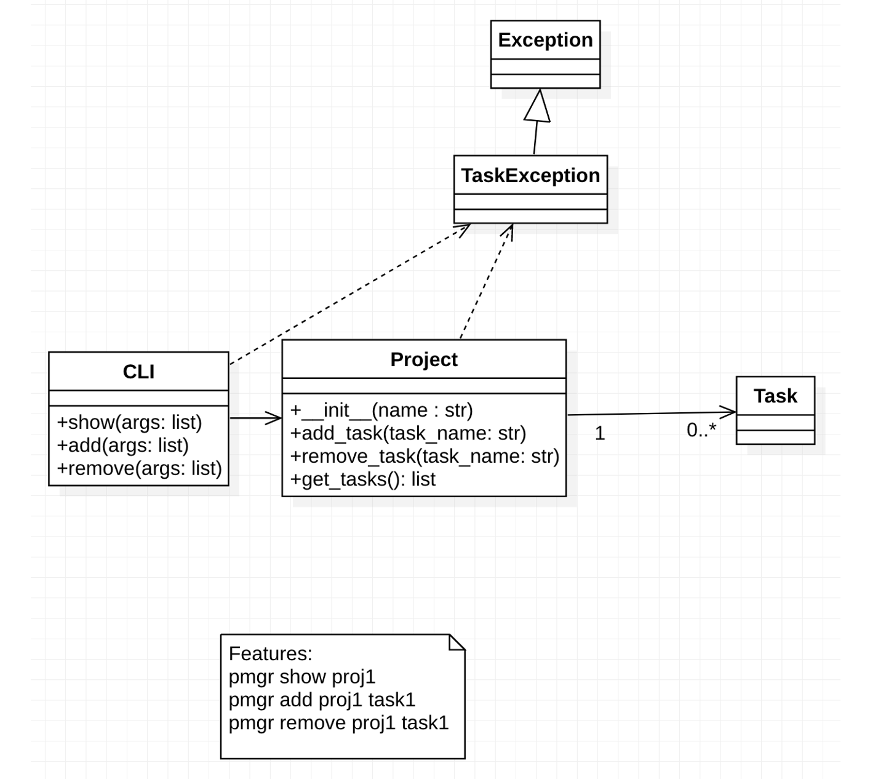

# softeng23-a3




1. In our UML diagram, should Task be a class or should it simply be a string?  Why or why not?

Based on the functions ```add_task``` and ```remove_task``` of the Project class in the UML diagram, we think a task should be a string. 

2. What future enhancements might you add to this project next?  Does the answer to this question change your answer to the first question?
   
- Add subtask to task
- Remove subtask from task
- Get subtasks from task
- Add project
- Remove project
  
Yes, this changes our answer because a Task can have subtasks and a Task would need methods of get_subtasks(), add_subtask(task_names: str), remove_subtasks(task_name: str).
